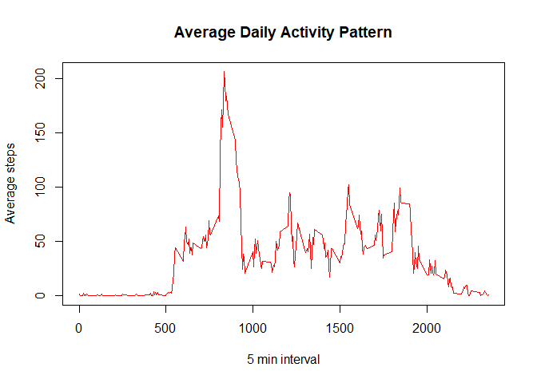
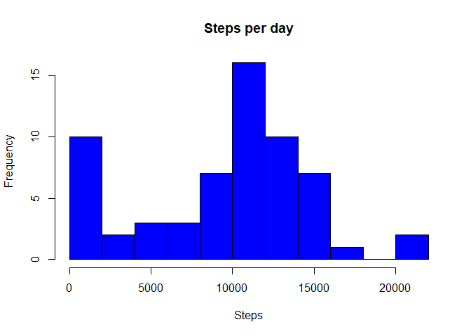

## Introduction

It is now possible to collect a large amount of data about personal movement using activity monitoring devices such as a [Fitbit](http://www.fitbit.com/), [Nike Fuelband](http://www.nike.com/us/en_us/c/nikeplus-fuelband), or [Jawbone Up](https://jawbone.com/up). These type of devices are part of the “quantified self” movement – a group of enthusiasts who take measurements about themselves regularly to improve their health, to find patterns in their behavior, or because they are tech geeks. But these data remain under-utilized both because the raw data are hard to obtain and there is a lack of statistical methods and software for processing and interpreting the data.  

This project use of data from a personal activity monitoring device. This device collects data at 5 minute intervals through out the day. The data consists of two months of data from an anonymous individual collected during the months of October and November, 2012 and include the number of steps taken in 5 minute intervals each day.  

The data can be downloaded from the web site: [Activity monitoring data](https://d396qusza40orc.cloudfront.net/repdata%2Fdata%2Factivity.zip) [52K]  

The variables included in this dataset are:

- **steps:** Number of steps taking in a 5-minute interval (missing values are coded as *NA*)  
- **date:** The date on which the measurement was taken in YYYY-MM-DD format  
- **interval:** Identifier for the 5-minute interval in which measurement was taken  

The dataset is stored in a comma-separated-value (CSV) file and there are a total of 17,568 observations in this dataset.  


## Loading and preprocessing the data


```r
activity = read.csv("activity.csv", header = TRUE, colClasses = c("numeric", "Date", "numeric")) # loading data into memory
```

## What is mean total number of steps taken per day?


```r
stepsperday <- aggregate(steps ~ date, activity, sum)
hist(stepsperday$steps, main = "Steps per day", xlab = "Steps", col = "blue", breaks = 8)
```

<!-- -->

Calculating the mean and median of steps taken per day:  


```r
meansteps <- as.character(round(mean(stepsperday$steps)))
mediansteps <- as.character(round(median(stepsperday$steps)))
```

The mean and median total number of steps taken per day respectively: **10766** and **10765**  

## What is the average daily activity pattern?

Make a time series plot (i.e. **type = "1"**) of the 5-minute interval (x-axis) and the average number of steps taken, averaged across all days (y-axis)  


```r
stepsinterval <- aggregate(steps ~ interval, activity, mean) # data aggregation
plot(stepsinterval$interval, stepsinterval$steps, # plotting
     type="l",
     main = "Average Daily Activity Pattern", 
     xlab = "5 min interval", 
     ylab = "Average steps", 
     col = "red")
```

<!-- -->

Calculating the maximum number of steps on a 5 min interval


```r
maxsteps <- stepsinterval$interval[which.max(stepsinterval$steps)]
```

On average across all the days in the dataset, the maximum number of steps on a 5 min interval: **835**  

## Imputing missing values
Calculate and report the total number of missing values in the dataset (i.e. the total number of rows with _NA_)


```r
missing <- nrow(activity[is.na(activity$steps),]) # total of NA values
percent <- scales::percent(missing / nrow(activity))
```

Total number of missing values in the dataset is **2304** which represents **13%** of total.  

Let's create a new dataset and assume _NA_ values equal to zero.


```r
activity2 <- activity
activity2[is.na(activity2$steps), "steps"] <- 0
```

Now let's redo the first graph with these new data


```r
stepsperday2 <- aggregate(steps ~ date, activity2, sum)
hist(stepsperday2$steps, main = "Steps per day", xlab = "Steps", col = "blue", breaks = 8)
```

<!-- -->

Calculating the mean and median of steps taken per day:  


```r
meansteps2 <- as.character(round(mean(stepsperday2$steps)))
mediansteps2 <- as.character(round(median(stepsperday2$steps)))
```

The mean and median total number of steps taken per day  are now respectively: **9354** and **10395**, which differs from previous values (**10766** and **10765**).  


## Are there differences in activity patterns between weekdays and weekends?

Creating a new factor variable in the dataset with two levels – “weekday” and “weekend” indicating whether a given date is a weekday or weekend day

```r
activity2$daytype <- ifelse(weekdays(activity2$date) %in% 
    c("Satuday", "Sunday"), "weekend", "weekday")
```

A panel plot containing a time series plot (i.e. type = "1") of the 5-minute interval (x-axis) and the average number of steps taken, averaged across all weekday days or weekend days (y-axis).


```r
graph <- activity2 %>% group_by(interval, daytype) %>% summarise(steps = mean(steps))
```

```
## `summarise()` regrouping output by 'interval' (override with `.groups` argument)
```

```r
ggplot(data = graph, aes(x = interval, y = steps)) +
  facet_grid(daytype ~ .) +
  geom_line(color = "steelblue") +
  ggtitle("Weekday vs. Weekend (Average Steps)")
```

<!-- -->
